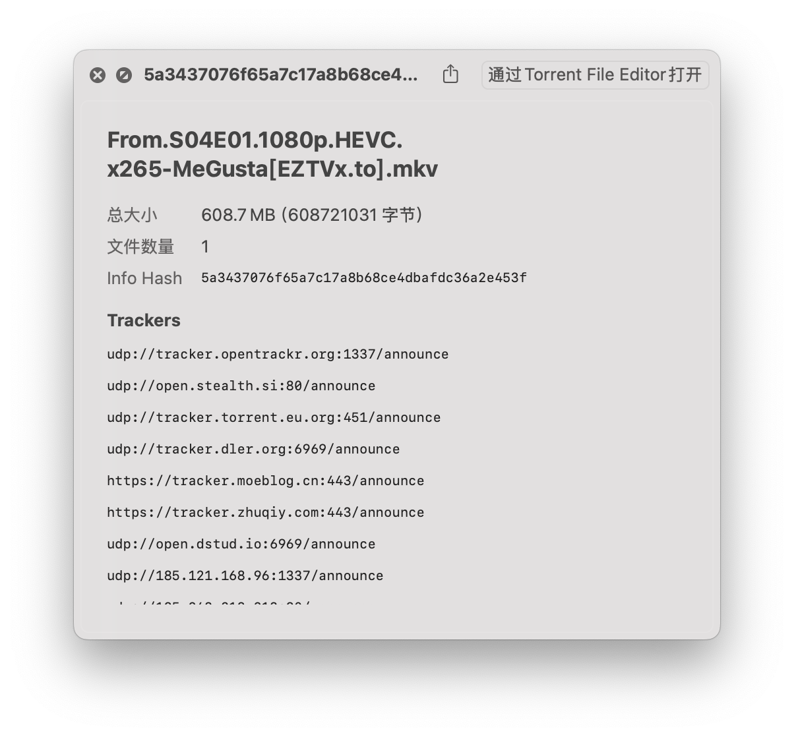
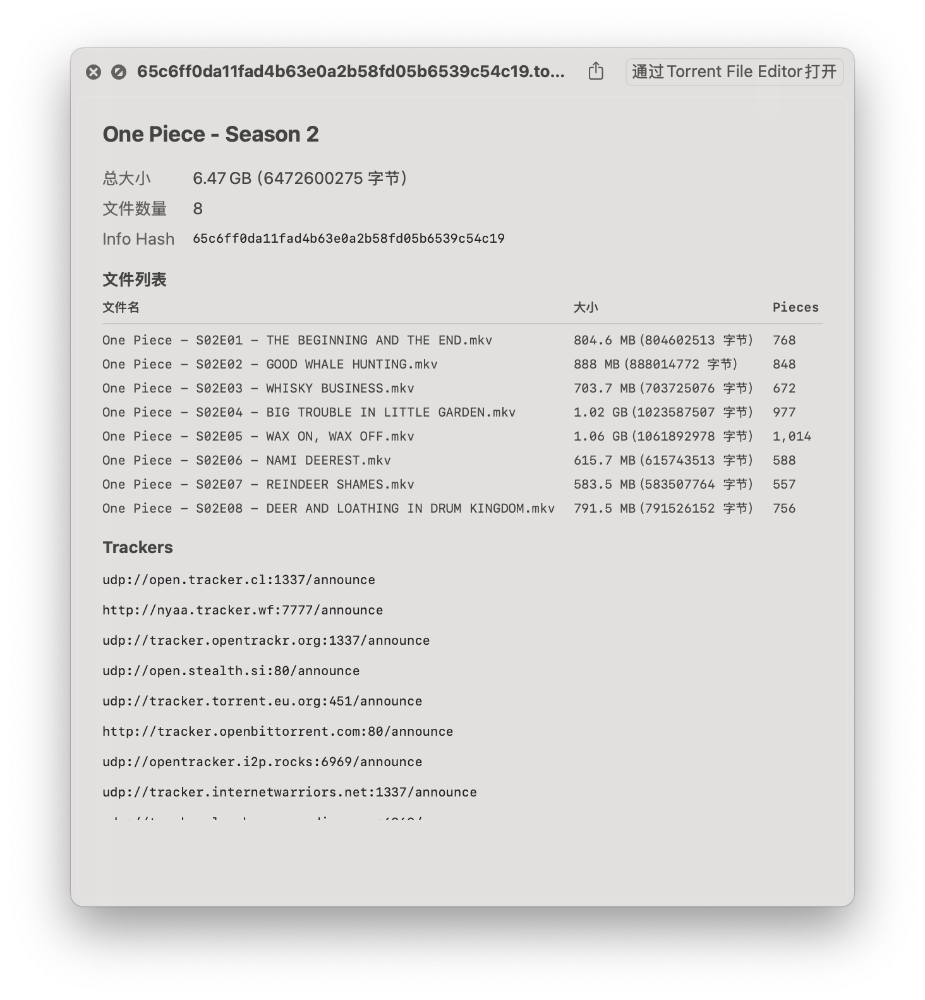

# Torrent Preview

macOS QuickLook plugin for previewing `.torrent` files. Just select a torrent file in Finder and press Space.

## Features

- Display torrent name, total size, file count, and info hash
- List all files with name, size, and piece count (for multi-file torrents)
- Show tracker URLs
- Supports dark mode and light mode
- Localized in English, Japanese, and Simplified Chinese

## Screenshots

| Single File | Multiple Files |
|:-----------:|:--------------:|
|  |  |

## Requirements

- macOS 13.0+

## Installation

Download the latest `TorrentPreview.zip` from [Releases](../../releases), unzip, and drag `TorrentPreview.app` to the Applications folder.

On first launch, right-click the app and select "Open" to bypass Gatekeeper.

After opening the app once, the QuickLook extension will be available system-wide.

## Build from Source

```bash
git clone https://github.com/reiy-leo/torrent-preview.git
cd torrent-preview
open TorrentPreview.xcodeproj
```

Build and run the **TorrentPreview** scheme in Xcode.

## License

MIT
